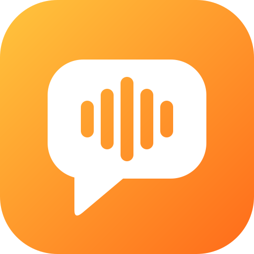

<p align="center">
  
</p>

# Yap

Tap right ⌘, talk, tap again. Your words land wherever your cursor is, near instantly, because everything runs on your Mac. No account, no cloud, no minutes, free forever.

## Install

You need a Mac with Apple Silicon (M1 or newer). That's it.

**1. Install [Homebrew](https://brew.sh)** if you don't have it. Paste this in Terminal:

```
/bin/bash -c "$(curl -fsSL https://raw.githubusercontent.com/Homebrew/install/HEAD/install.sh)"
```

**2. Install Yap.** Paste this in Terminal:

```
git clone https://github.com/dertuman/yap && cd yap && ./install.sh
```

This downloads the speech model (574 MB, one time), builds the app, and puts it in Applications. Takes a few minutes.

**3. Allow the two permissions** when macOS asks: **Microphone** and **Accessibility**. If you missed the prompts, go to System Settings > Privacy & Security and turn Yap on in both lists.

**4. Tap right ⌘ and start talking.** Tap again to stop. Done.

## Use

- Tap right ⌘ to start, yap, tap again to stop. The text is at your cursor before you can look for it.
- Or hold right ⌘ and speak, release to transcribe, walkie-talkie style.
- Press any other key while holding and it cancels, so real shortcuts still work.
- The menu bar mic turns red while recording.

Click the menu bar mic for the two settings:

- **Trigger Key.** Right ⌘ by default. Pick either side of ⌘, ⌥, ⌃, ⇧, or Fn instead. Sides are separate, so left ⇧ can still be shift while right ⇧ dictates.
- **Start / Stop Sounds.** The little ticks when recording opens and closes. Turn them off if you'd rather work in silence.

Want Yap to start when your Mac starts? System Settings > General > Login Items, add Yap.

## Why

I was using a paid dictation app and ran out of minutes. So I built this: the same thing with most features stripped away. It runs Whisper large-v3-turbo locally through [whisper.cpp](https://github.com/ggml-org/whisper.cpp).

## How it works

A handful of small Swift files. A menu bar app watches your trigger key with an event tap, records 16 kHz audio, sends it to a local whisper-server (kept running so the model stays loaded and transcription is basically instant), then pastes the result at your cursor and restores your clipboard. Nothing ever leaves your Mac.

Want a different model? Grab any ggml model from [Hugging Face](https://huggingface.co/ggerganov/whisper.cpp/tree/main), put it in `~/Library/Application Support/Yap/models/`, and change the filename in `Sources/Transcriber.swift`.

## License

MIT
